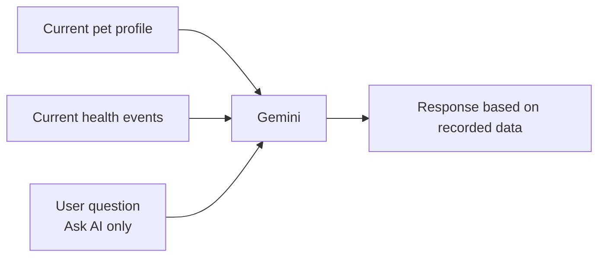

# PetLife AI — Responsible AI Use

**Project:** PetLife AI — AI-Powered Pet Health Timeline
**AI model:** Google Gemini (`gemini-2.5-flash`)
**Status:** Working MVP / prototype

> **Core principle:**
> **PetLife AI helps pet parents understand their recorded information. It does not replace professional veterinary judgment.**

---

## Table of Contents

1. [Purpose of AI](#1-purpose-of-ai)
2. [AI Features](#2-ai-features)
3. [Data Grounding](#3-data-grounding)
4. [No Invented Medical Information](#4-no-invented-medical-information)
5. [Medical Safety Boundaries](#5-medical-safety-boundaries)
6. [Human / Veterinary Oversight](#6-human--veterinary-oversight)
7. [Data Privacy & API Security](#7-data-privacy--api-security)
8. [Error Handling](#8-error-handling)
9. [AI Limitations](#9-ai-limitations)
10. [Future Responsible AI Improvements](#10-future-responsible-ai-improvements)

---

## 1. Purpose of AI

AI in PetLife AI has one purpose: **to help pet parents understand the health information they have already recorded.**

It does this by:

- turning recorded events into a readable health story, and
- answering natural-language questions about the recorded data.

AI is not used to make medical decisions. Exact calculations (weight change, percentage change, event counts, repeated events) and reminders are handled by regular application logic rather than by AI.

---

## 2. AI Features

| Feature | Uses Gemini? | Description |
|---|---|---|
| **AI Health Story** | Yes | Converts the pet profile and health events into a structured story: *What Happened*, *What Changed*, *Patterns to Monitor*, *Suggested Next Steps* |
| **Ask PetLife AI** | Yes | Answers natural-language questions about the current pet's recorded information |
| **Personalized explanations** | Yes | Explains the pet's own recorded data |
| **Health Insights** | **No** | Deterministic JavaScript: weight difference, weight percentage change, recent event counts, repeated-event detection, record-based patterns |
| **Care Reminders** | **No** | Regular application logic with Firestore persistence |

**Design choice:** Numeric insights are deliberately kept out of the AI model so they are exact and repeatable.

---

## 3. Data Grounding

Gemini receives only the information needed to answer for the current pet:

| Input | AI Health Story | Ask PetLife AI |
|---|---|---|
| Current pet profile | ✔ | ✔ |
| Current health events | ✔ | ✔ |
| User's question | — | ✔ |

Responses are intended to be based on this recorded data, so answers are specific to the user's pet rather than generic.

---

## 4. No Invented Medical Information

Gemini must **not** invent:

| Must not invent |
|---|
| Diagnoses |
| Medication |
| Dosage |
| Veterinarians |
| Hospitals |
| Symptoms |
| Medical history |

**If information is not recorded, the AI should state that the information is not available** instead of guessing or filling gaps.

---

## 5. Medical Safety Boundaries

PetLife AI does **not**:

- diagnose medical conditions,
- prescribe medication,
- recommend dosage changes, or
- replace veterinary care.

"Suggested Next Steps" in the AI Health Story are intended to be responsible, record-based suggestions (for example, keeping records up to date or following up with a veterinarian), not medical instructions.

**Disclaimer:**

> **"PetLife AI provides informational insights based on the records you provide. It does not diagnose or replace veterinary care."**

---

## 6. Human / Veterinary Oversight

- PetLife AI is an **informational tool**, not a clinical one.
- Veterinary professionals remain responsible for diagnosis, treatment, and medication decisions.
- Pet parents remain in control of their own records and decide what to enter.
- For any health concern, users should consult a veterinarian. The AI does not replace that step.

---

## 7. Data Privacy & API Security

| Control | Detail |
|---|---|
| **API key server-side** | The Gemini API key remains on the server |
| **Secrets not committed** | `.env.local` is not committed |
| **No client-exposed key** | No `VITE_GEMINI_API_KEY` is used |
| **Client bundle** | The Gemini SDK is not included in the client bundle |
| **Input validation** | API inputs are validated by the server-side handlers |
| **User-scoped data** | Firestore data is scoped to authenticated users (`users/{uid}/...`) |
| **Authentication** | Users sign in with Firebase Authentication |

Only the current pet's profile and events (plus the question, for Ask AI) are sent to Gemini for a request.

---

## 8. Error Handling

| Situation | Intended behavior |
|---|---|
| Invalid API input | Rejected by input validation with a clear error |
| Gemini unavailable or request fails | The AI feature shows an error message; other features (timeline, insights, reminders) continue to work because they do not depend on Gemini |
| Information missing from records | The AI states that the information is not available rather than inventing it |
| Sparse or no health events | Output is limited to what is recorded; the AI does not fabricate a history |

---

## 9. AI Limitations

- The AI depends on the **quality and completeness of the records entered by the pet parent**.
- It **cannot independently verify** veterinary records.
- It may miss context that was never recorded.
- Like any language model, it can produce imperfect wording or summaries, so users should treat output as informational and check it against their own records.
- It is not a diagnostic tool and is not a substitute for a veterinarian.

---

## 10. Future Responsible AI Improvements

> **These are FUTURE ideas only. They are not implemented in the current MVP.**

| Future improvement | Purpose |
|---|---|
| Stronger review of AI output against recorded data | Further reduce unsupported statements |
| Clearer indication of which records support each statement | Improve transparency |
| Feedback mechanism for users to flag unhelpful or incorrect AI output | Improve quality over time |
| Responsible handling of future data sources (for example, OCR of veterinary documents, wearable data) | Maintain grounding and accuracy as inputs expand |
| Veterinary review of safety wording | Confirm boundaries are appropriate |
