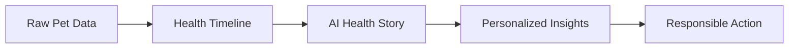
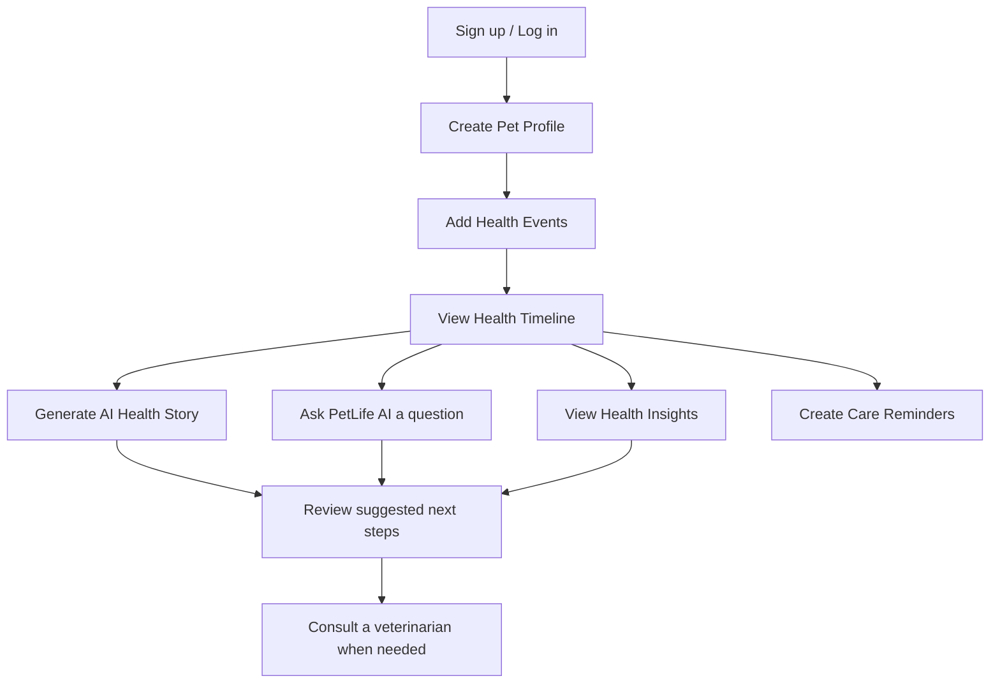

# PetLife AI — Product Plan

**Project:** PetLife AI — AI-Powered Pet Health Timeline
**Platform:** Responsive web application (React + Vite)
**Status:** Working MVP / prototype

> **Note on scope:** PetLife AI is currently a responsive web application. It is **not** a native Android or iOS application. Items listed under [Future Roadmap](#15-future-roadmap) are planned ideas only and are **not** implemented.

---

## Table of Contents

1. [Product Overview](#1-product-overview)
2. [Problem Statement](#2-problem-statement)
3. [Target User](#3-target-user)
4. [User Needs](#4-user-needs)
5. [Product Goal](#5-product-goal)
6. [Proposed Solution](#6-proposed-solution)
7. [Core User Journey](#7-core-user-journey)
8. [MVP Features](#8-mvp-features)
9. [AI Value](#9-ai-value)
10. [Personalization](#10-personalization)
11. [UX Principles](#11-ux-principles)
12. [Product Design Decisions](#12-product-design-decisions)
13. [Responsible Product Boundaries](#13-responsible-product-boundaries)
14. [Success Criteria](#14-success-criteria)
15. [Future Roadmap](#15-future-roadmap)

---

## 1. Product Overview

PetLife AI turns raw pet health records into a meaningful health story. Pet parents record health events for their pet, view them chronologically, and use AI to understand what happened, what changed, and which patterns may be worth monitoring.

**Core concept:**

> Transform raw pet health records into a meaningful health story.

| Stage | What it means in PetLife AI |
|---|---|
| Raw Pet Data | Pet profile and health events entered by the pet parent |
| Health Timeline | Events shown in chronological order |
| AI Health Story | Gemini-generated narrative of the recorded data |
| Personalized Insights | Calculated changes and patterns from the pet's own records |
| Responsible Action | Suggested next steps and reminders, with clear safety boundaries |

---

## 2. Problem Statement

Pet parents may have health information recorded across different events and dates, but the information does not automatically give them an understandable picture of:

- what happened,
- what changed,
- what patterns exist, or
- what may need attention.

Individual records exist, but the story connecting them does not.

---

## 3. Target User

**Primary user:** Pet parents / pet owners.

The product is designed for people who want to keep track of their pet's health information and understand it more easily, without needing medical expertise.

---

## 4. User Needs

| # | User need | How PetLife AI addresses it |
|---|---|---|
| 1 | Record pet health information | Pet Profile and Health Events |
| 2 | View health history chronologically | Health Timeline |
| 3 | Understand recent changes | AI Health Story ("What Changed") and Health Insights |
| 4 | Identify repeated patterns | Health Insights (repeated-event detection) and AI Health Story ("Patterns to Monitor") |
| 5 | Ask questions about recorded information | Ask PetLife AI |
| 6 | Remember important care dates | Care Reminders |

---

## 5. Product Goal

Help pet parents **understand the health information they have recorded** for their pet, by organizing it into a timeline, explaining it in plain language, and highlighting changes and patterns, while staying within clear medical safety boundaries.

---

## 6. Proposed Solution

PetLife AI combines three approaches:

1. **Structured record keeping** — a pet profile, health events, and reminders stored per user.
2. **AI explanation** — Google Gemini turns recorded data into a readable health story and answers natural-language questions about it.
3. **Deterministic calculation** — regular application logic computes weight changes, event counts, and repeated events, so numeric insights do not depend on an AI model.

---

## 7. Core User Journey

**Step-by-step:**

1. The pet parent authenticates with Firebase Authentication.
2. They create a profile for their pet.
3. They add health events over time.
4. They view the events on the Health Timeline.
5. They generate an AI Health Story to see what happened, what changed, and what to monitor.
6. They ask PetLife AI questions about the recorded information.
7. They review Health Insights such as weight changes and repeated events.
8. They set care reminders for important dates.
9. For any health concern, they follow up with a veterinarian; PetLife AI does not replace veterinary care.

---

## 8. MVP Features

All features below are **implemented** in the current MVP.

| # | Feature | Description |
|---|---|---|
| 1 | **Pet Profile** | Store basic information about the pet, used as context for AI features |
| 2 | **Health Events** | Record health events with dates |
| 3 | **Health Timeline** | View recorded events in chronological order |
| 4 | **AI Health Story** | Gemini generates a structured story: *What Happened*, *What Changed*, *Patterns to Monitor*, *Suggested Next Steps* |
| 5 | **Ask PetLife AI** | Ask natural-language questions about the current pet's recorded information; answers are grounded in the pet profile and health events |
| 6 | **Health Insights** | Deterministic calculations: weight difference, weight percentage change, recent event counts, repeated-event detection, record-based patterns |
| 7 | **Care Reminders** | Create, edit, complete, and delete reminders, persisted in Firestore |
| 8 | **Authentication** | Firebase Authentication for user accounts |
| 9 | **Firestore Persistence** | Pet, event, and reminder data stored in Firebase Firestore |

---

## 9. AI Value

PetLife AI uses AI where language understanding and explanation add value, and regular logic where exact calculation is needed.

| Capability | Powered by | Why |
|---|---|---|
| Health-story generation | Gemini | Turns a list of records into a readable narrative |
| Natural-language questions | Gemini | Lets users ask questions in their own words |
| Personalized explanations | Gemini | Explains the pet's own recorded data |
| Weight calculations | Application logic | Exact and repeatable |
| Percentage changes | Application logic | Exact and repeatable |
| Event counting | Application logic | Exact and repeatable |
| Repeated-event detection | Application logic | Exact and repeatable |
| Reminders | Application logic | Date-based and predictable |

**AI model:** Google Gemini (`gemini-2.5-flash`).

---

## 10. Personalization

The AI receives:

- the **current pet profile**, and
- the **current pet's health events**

(and, for Ask PetLife AI, the **user's question**).

Because of this, responses are specific to the user's own pet rather than generic pet-health text. If something is not in the recorded data, the AI is instructed to say that the information is not available.

---

## 11. UX Principles

| Principle | Application |
|---|---|
| **Clarity** | Present records and AI output in clearly labeled sections (for example, *What Happened*, *What Changed*) |
| **Chronology first** | The timeline gives users an ordered view of their pet's history |
| **Grounded answers** | AI responses are based on recorded information |
| **Transparency** | A disclaimer makes clear that the product is informational only |
| **Simple data entry** | Users record events and reminders through straightforward forms |
| **Responsive design** | The interface works across screen sizes as a responsive web app |

---

## 12. Product Design Decisions

| Decision | Rationale |
|---|---|
| **Health Insights uses deterministic JavaScript, not Gemini** | Numeric results such as weight change and event counts should be exact and repeatable, not generated by a language model |
| **Gemini is called through server-side API handlers** | Keeps the Gemini API key off the client |
| **Web application first** | A responsive React + Vite web app allows a working MVP to be built and demonstrated quickly; native apps are future work |
| **Data scoped per user in Firestore** | Each user's pet data lives under their own `users/{uid}` path |
| **Structured AI output** | The AI Health Story uses a fixed set of sections so results are consistent and easy to read |
| **Grounding over open-ended chat** | Ask PetLife AI answers from the pet's records rather than general speculation |

---

## 13. Responsible Product Boundaries

> **PetLife AI helps pet parents understand their recorded information. It does not replace professional veterinary judgment.**

PetLife AI does **not**:

- diagnose medical conditions,
- prescribe medication,
- recommend dosage changes,
- invent medical records, doctors, hospitals, or symptoms, or
- replace veterinary care.

If information is not available in the recorded data, the AI states that it does not have that information.

**Disclaimer shown to users:**

> "PetLife AI provides informational insights based on the records you provide. It does not diagnose or replace veterinary care."

See `AI_RESPONSIBLE_USE.md` for full details.

---

## 14. Success Criteria

Success for this MVP is defined by whether the product delivers its intended experience end to end. No usage statistics or business metrics are claimed.

| Area | Success criterion |
|---|---|
| **Access** | A user can sign up, log in, and see only their own data |
| **Records** | A user can create a pet profile and add health events that persist in Firestore |
| **Timeline** | Recorded events appear in chronological order |
| **AI Health Story** | Gemini produces a structured story with *What Happened*, *What Changed*, *Patterns to Monitor*, and *Suggested Next Steps* |
| **Ask PetLife AI** | Questions receive answers grounded in the pet's recorded data |
| **Insights** | Weight difference, percentage change, event counts, and repeated events are calculated correctly |
| **Reminders** | Reminders can be created, edited, completed, and deleted, and persist |
| **Safety** | AI output does not diagnose, prescribe, or invent records, and the disclaimer is shown |
| **Security** | The Gemini API key is not exposed in the client bundle |
| **Responsiveness** | The application is usable across screen sizes |

---

## 15. Future Roadmap

> **All items below are FUTURE work. None are implemented in the current MVP.**

| Future item | Description |
|---|---|
| Native Android / iOS apps | Dedicated mobile applications (the current product is a web app) |
| Push notifications | Notifications for care reminders |
| Offline support | Use of the app without a connection |
| OCR for veterinary documents | Extract information from uploaded veterinary documents |
| Wearable / device integrations | Import data from pet wearables or devices |
| Voice AI | Voice-based interaction |
| Multiple pets | Support for more than one pet per account |
| Advanced analytics | Deeper analysis of health trends |
| Veterinary integrations | Connections with veterinary systems |
