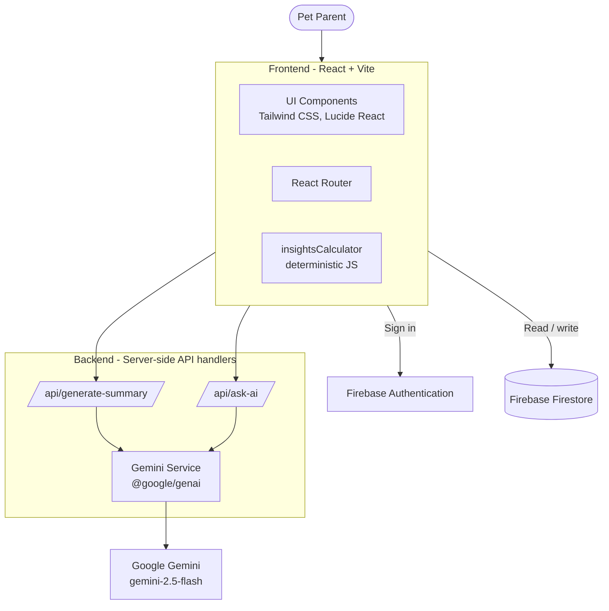
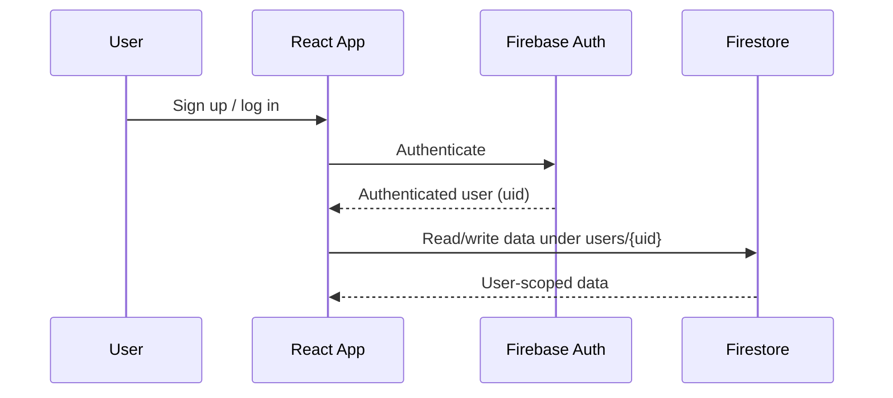
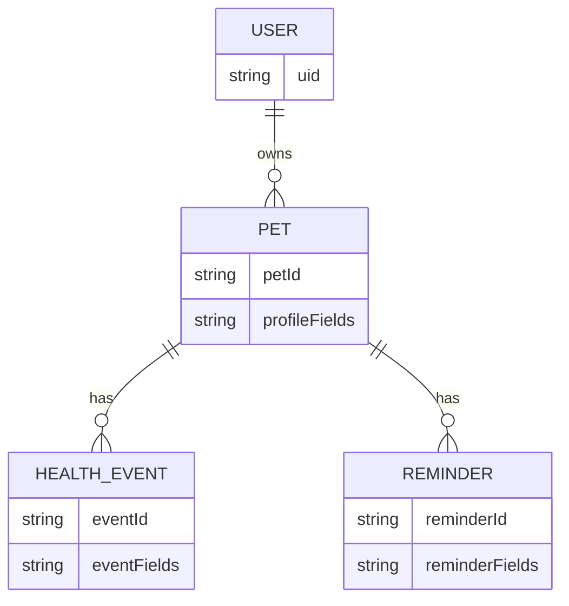
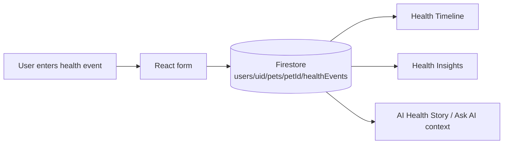
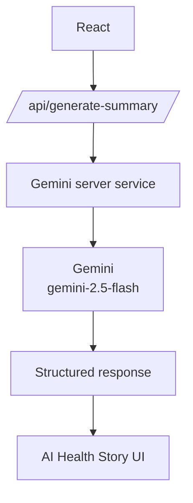
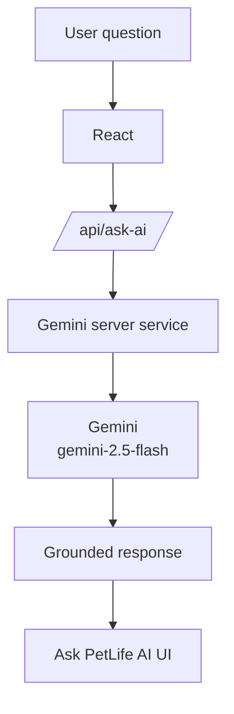
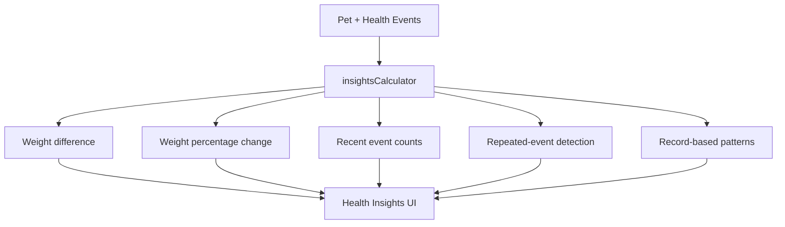
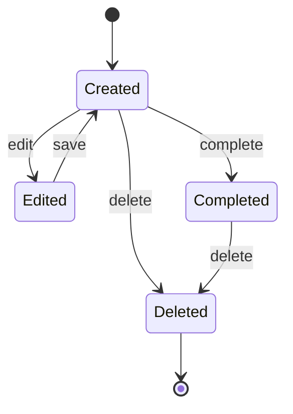
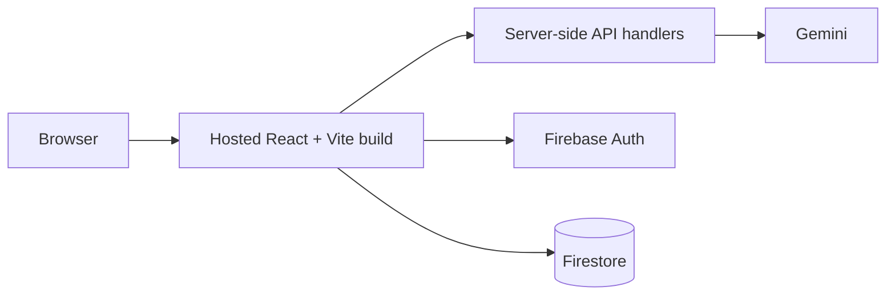

# PetLife AI — Technical Architecture

**Project:** PetLife AI — AI-Powered Pet Health Timeline
**Application type:** Responsive React + Vite web application
**Status:** Working MVP / prototype

> **Note:** The current application is a responsive web app. It is **not** a native Android/iOS application. Items in [Future Scalability](#16-future-scalability) are not implemented.

---

## Table of Contents

1. [Architecture Overview](#1-architecture-overview)
2. [Technology Stack](#2-technology-stack)
3. [Frontend Architecture](#3-frontend-architecture)
4. [Authentication Architecture](#4-authentication-architecture)
5. [Firestore Architecture](#5-firestore-architecture)
6. [Data Model](#6-data-model)
7. [Health Event Data Flow](#7-health-event-data-flow)
8. [AI Health Story Flow](#8-ai-health-story-flow)
9. [Ask AI Flow](#9-ask-ai-flow)
10. [Health Insights Architecture](#10-health-insights-architecture)
11. [Reminder Architecture](#11-reminder-architecture)
12. [Security](#12-security)
13. [Error Handling](#13-error-handling)
14. [Responsive Architecture](#14-responsive-architecture)
15. [Deployment Architecture](#15-deployment-architecture)
16. [Future Scalability](#16-future-scalability)

---

## 1. Architecture Overview

PetLife AI has a React frontend, a thin server-side API layer that talks to Gemini, and Firebase for authentication and data storage.



**Key architectural points:**

- The **frontend** handles UI, routing, Firestore access, and Health Insights calculation.
- The **backend API handlers** exist to call Gemini, so the API key stays server-side.
- **Firebase Authentication** identifies the user; **Firestore** stores user-scoped data.
- **Health Insights is not AI-based**; it is deterministic JavaScript.

---

## 2. Technology Stack

| Layer | Technology |
|---|---|
| **Frontend** | React, Vite, JavaScript, Tailwind CSS, React Router, Lucide React |
| **Backend / API** | Server-side API handlers, Node-based Gemini integration, `@google/genai` |
| **Database** | Firebase Firestore |
| **Authentication** | Firebase Authentication |
| **AI** | Google Gemini (`gemini-2.5-flash`) |

---

## 3. Frontend Architecture

- **React + Vite** provides the component-based UI and build tooling.
- **JavaScript** is used throughout.
- **Tailwind CSS** handles styling and responsive layout.
- **React Router** manages navigation between views (for example, authentication, pet profile, timeline, insights, reminders).
- **Lucide React** provides icons.

**Functional areas in the UI:**

| Area | Purpose |
|---|---|
| Authentication | Sign up / log in |
| Pet Profile | Create and view the pet's profile |
| Health Events | Add and manage health events |
| Health Timeline | Chronological view of events |
| AI Health Story | Calls `/api/generate-summary` and renders the structured result |
| Ask PetLife AI | Calls `/api/ask-ai` with the user's question |
| Health Insights | Renders results from `insightsCalculator` |
| Care Reminders | Create, edit, complete, delete reminders |

---

## 4. Authentication Architecture

Authentication uses **Firebase Authentication**.



The authenticated user's `uid` is used as the root of that user's data in Firestore, so each user's data is scoped to their own account.

---

## 5. Firestore Architecture

Data is stored in **Firebase Firestore** using nested collections under each user.

```text
users/{uid}
    └── pets/{petId}
          ├── healthEvents/{eventId}
          └── reminders/{reminderId}
```

| Path | Contents |
|---|---|
| `users/{uid}` | The authenticated user's root document |
| `users/{uid}/pets/{petId}` | Pet profile |
| `users/{uid}/pets/{petId}/healthEvents/{eventId}` | Health events for that pet |
| `users/{uid}/pets/{petId}/reminders/{reminderId}` | Care reminders for that pet |

**Why this structure:** Nesting under `users/{uid}` keeps each user's data separate and makes user-scoped access straightforward.

---

## 6. Data Model



The data model reflects the Firestore hierarchy: a user has pets; each pet has health events and reminders. Detailed field definitions are defined in the application code.

---

## 7. Health Event Data Flow



1. The user adds a health event through the UI.
2. The event is persisted in Firestore under the pet's `healthEvents` collection.
3. The stored events feed the **Health Timeline**, the **Health Insights** calculations, and the context sent to the AI features.

---

## 8. AI Health Story Flow



**Input:** current pet profile + current health events.
**Output (structured):**

| Section | Purpose |
|---|---|
| What Happened | Summary of recorded events |
| What Changed | Changes observed in the records |
| Patterns to Monitor | Repeated or notable patterns in the records |
| Suggested Next Steps | Responsible, non-diagnostic next steps |

The API handler validates its input, calls the server-side Gemini service, and returns a structured response that the UI renders.

---

## 9. Ask AI Flow



**Input:** user's question + current pet profile + current health events.
**Output:** an answer grounded in the recorded data. If the information is not recorded, the AI states that it does not have it.

---

## 10. Health Insights Architecture

Health Insights is **not Gemini-based**. It is deterministic JavaScript.



**Architectural decision:** Numeric and pattern calculations use regular application logic because they must be exact, repeatable, and independent of a language model. Gemini is reserved for narrative generation and natural-language Q&A.

| Calculation | Approach |
|---|---|
| Weight difference | Deterministic JS |
| Weight percentage change | Deterministic JS |
| Recent event counts | Deterministic JS |
| Repeated-event detection | Deterministic JS |
| Record-based patterns | Deterministic JS |

---

## 11. Reminder Architecture

Reminders are stored in Firestore under the pet:

```text
users/{uid}/pets/{petId}/reminders/{reminderId}
```



Users can **create, edit, complete, and delete** reminders. Reminder logic is regular application logic (not AI).

---

## 12. Security

| Control | Detail |
|---|---|
| **Server-side API key** | The Gemini API key stays on the server |
| **Secrets not committed** | `.env.local` is not committed to the repository |
| **No client-exposed key** | There is no `VITE_GEMINI_API_KEY` |
| **Client bundle** | The Gemini SDK and API key are not included in the client production bundle |
| **Input validation** | API inputs are validated by the server-side handlers |
| **User-scoped data** | Firestore data is scoped to authenticated users under `users/{uid}` |

---

## 13. Error Handling

- API handlers validate inputs and return clear errors for invalid requests.
- The frontend handles failed or unavailable AI responses without breaking the rest of the app; timeline, insights, and reminders do not depend on Gemini.
- AI features are designed to say when information is unavailable rather than invent it.
- Firestore operations and authentication errors are handled in the UI.

See `AI_RESPONSIBLE_USE.md` for AI-specific error and safety handling.

---

## 14. Responsive Architecture

- The UI is built with **Tailwind CSS** utility classes for responsive layout.
- The same React web application serves different screen sizes.
- This is a **responsive web app**; it is not a native mobile application.

---

## 15. Deployment Architecture



- The **frontend** is built with Vite into static assets.
- The **API handlers** run server-side and hold the Gemini API key via environment configuration.
- **Firebase Authentication** and **Firestore** are managed Firebase services.

---

## 16. Future Scalability

> **All items below are FUTURE work and are not implemented.**

| Future item | Architectural implication |
|---|---|
| Native Android / iOS applications | Separate client apps consuming the same backend services |
| Push notifications | Notification service for reminders |
| Offline support | Local caching and sync |
| OCR for veterinary documents | Document-processing pipeline |
| Wearable / device integrations | Ingestion of device data |
| Voice AI | Voice input/output layer |
| Multiple pets | Multi-pet selection and data handling |
| Advanced analytics | Expanded analysis beyond current insights |
| Veterinary integrations | External system integrations |
